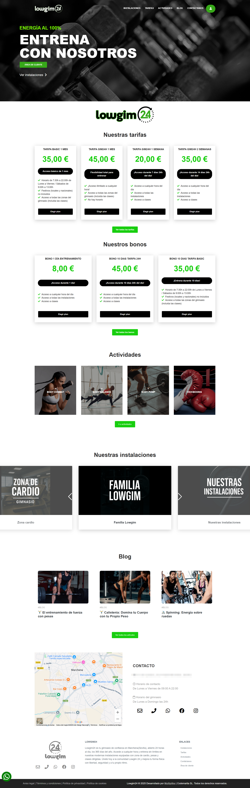
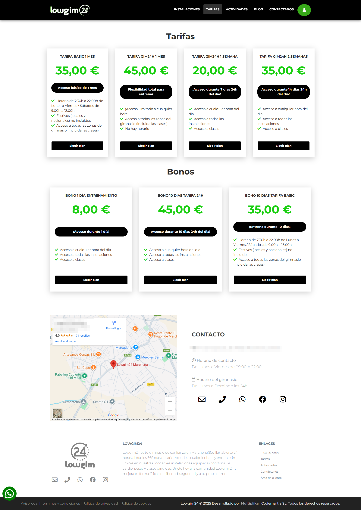
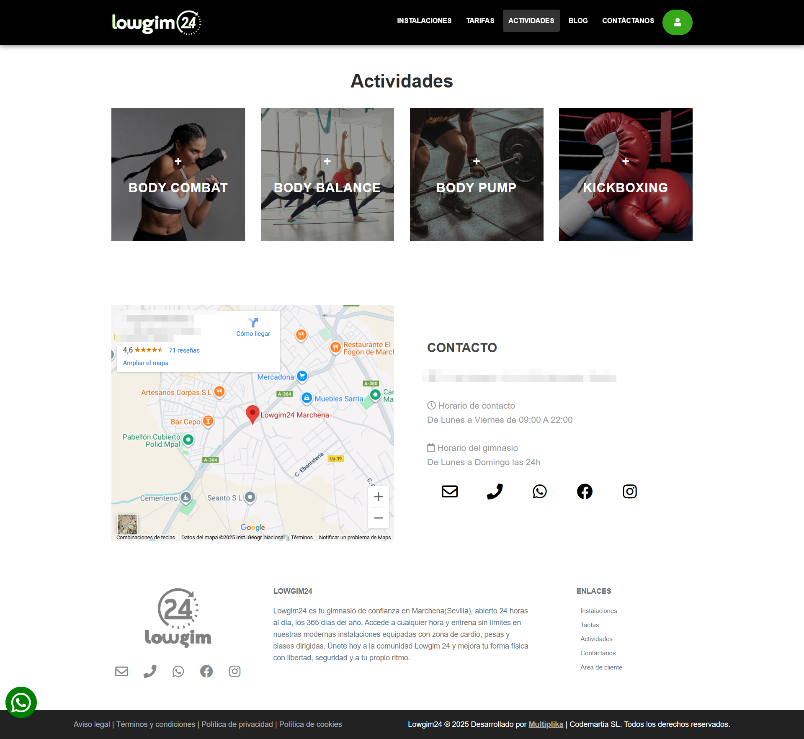
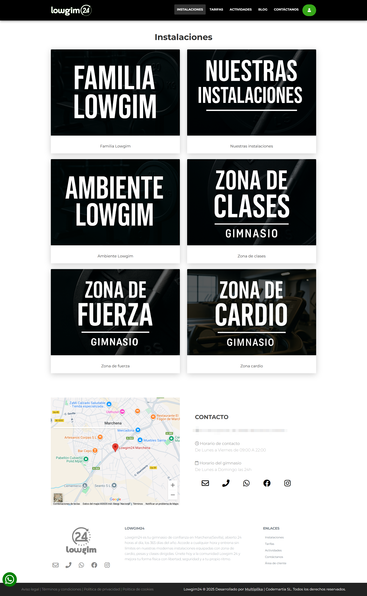

# 🏋️ LowGim Theme (WordPress)

Tema personalizado desarrollado durante mis prácticas para un gimnasio 24/7, con integración de WooCommerce para planes de precios y Custom Post Types para actividades, instalaciones y blog.

> **Nota:** Esta es una versión limpia de datos sensibles. Todo el contenido mostrado es ficticio y se utiliza únicamente para fines de demostración.

---

## ✨ Características principales
- **Custom Post Types (CPTs)**:
  - `blog`: publicaciones y noticias.
  - `actividades`: clases y entrenamientos.
  - `instalaciones`: con galería de imágenes y descripciones.
- **WooCommerce**:
  - Venta de planes de precios como productos.
  - Restricción a un solo plan por carrito.
  - Login obligatorio antes de comprar.
- **Frontend moderno**:
  - Carruseles con **SwiperJS**.
  - Galería con **GLightbox**.
  - SCSS organizado y compilado a CSS.
- **Optimización WordPress**:
  - Scripts y estilos encolados con `wp_enqueue_*`.
  - Soporte para `title-tag` dinámico.
  - Preparado para traducciones (i18n).

---

## 🖼️ Capturas de pantalla

| Página de inicio | Página de tarifas |
|------------------|-------------------|
|  |  |

| Página de actividades | Página de instalaciones |
|-----------------------|-------------------------|
|  |  |

---

## 📂 Instalación
1. Instala WordPress en tu servidor local o de producción.
2. Copia la carpeta `lowgim-theme` dentro de `wp-content/themes/`.
3. Activa el tema en **Apariencia → Temas**.
4. (Opcional) Instala y activa WooCommerce para las funcionalidades de tienda.

---

## 🛠️ Requisitos
- WordPress 6.4 o superior.
- PHP 7.4 o superior.
- WooCommerce (opcional para la parte de tienda).

---

## 🧾 License
This project is licensed under the **[MIT License](LICENSE)**.  
📌 A Spanish translation is also available in **[LICENSE.es.md](LICENSE.es.md)** (for reference only).

---

## ✍️ Autor
Código desarrollado por **José Ojeda López** durante mi colaboración en **Multiplika**

